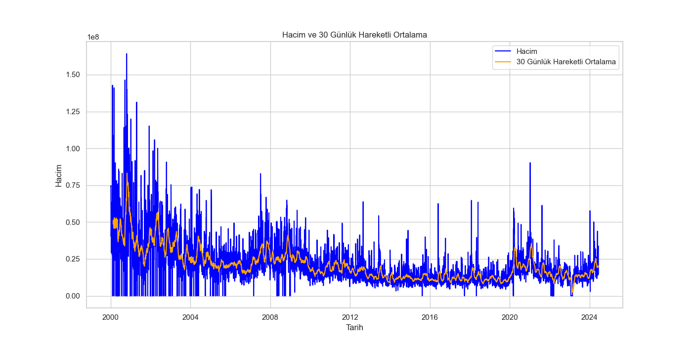
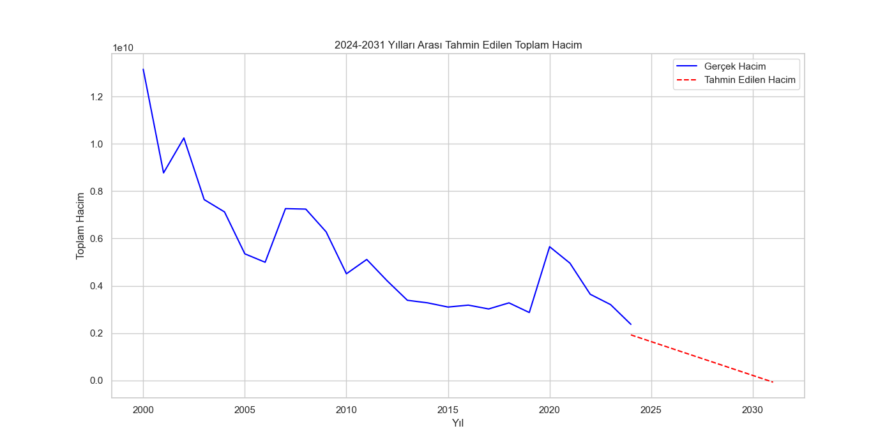
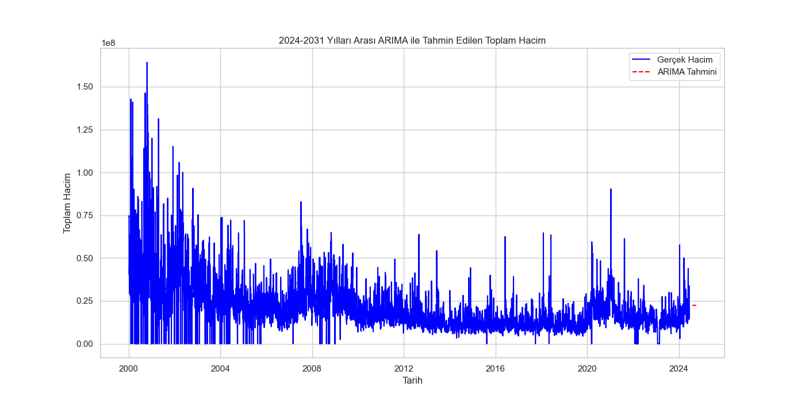
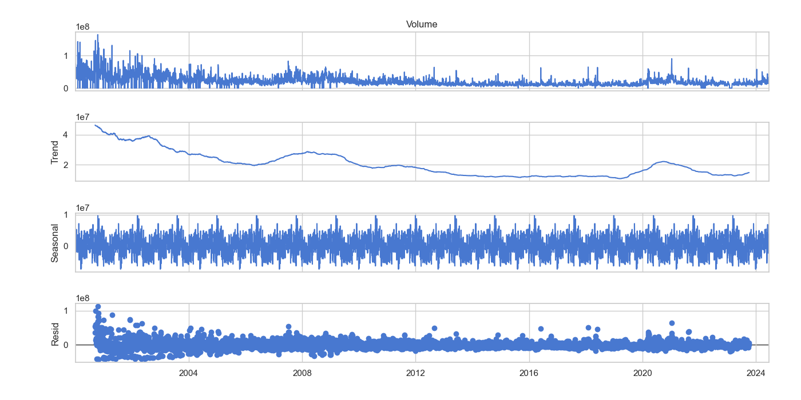
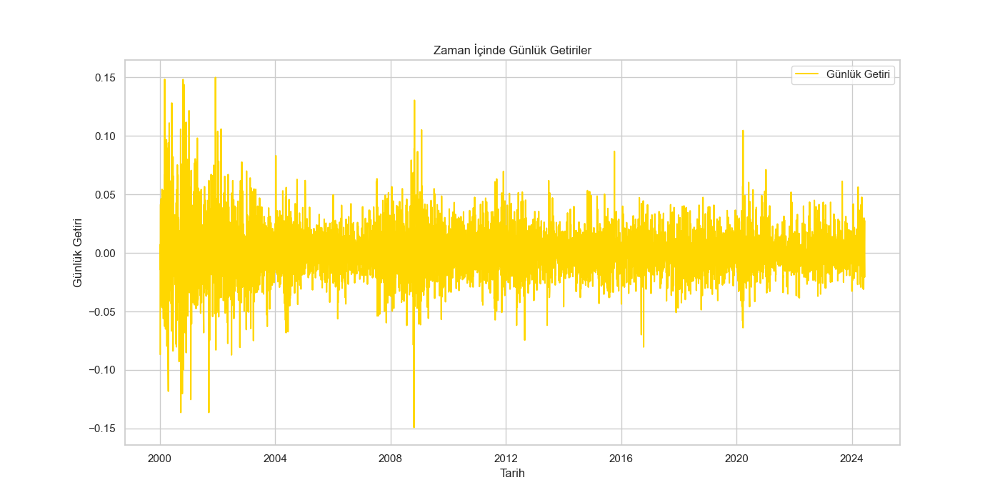
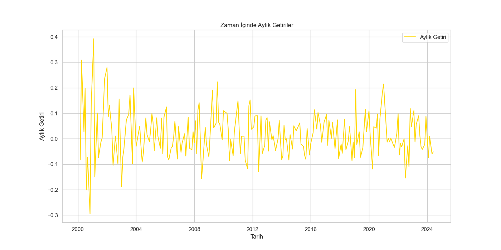
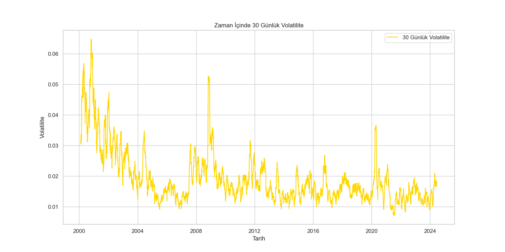

# 📊 Samsung Hisse Senedi Hacim ve Fiyat Tahmini Projesi

## 📖 Genel Bakış

Bu projede, Samsung hisse senedi verileri kullanılarak çeşitli analizler ve tahmin modelleri geliştirilmiştir. Veri analizleri ve modeller, yatırımcıların ve piyasa analistlerinin karar alma süreçlerine yardımcı olmayı amaçlamaktadır.

## 📂 Proje Klasör Yapısı

```plaintext
.
├── data
│   └── Samsung Dataset.csv
├── results
│   ├── volume_ma30.png
│   ├── linear_regression_forecast.png
│   ├── arima_forecast.png
│   ├── seasonal_trend_decomposition.png
│   ├── daily_returns.png
│   ├── monthly_returns.png
│   ├── volatility_analysis.png
│   ├── lstm_predictions.png
│   ├── lstm_residuals_histogram.png
│   ├── lstm_future_forecast.png
│   ├── lstm_train_test_plot.png
│   ├── lstm_mse_plot.png
│   ├── lstm_mae_plot.png
│   ├── lstm_r2_plot.png
│   ├── prophet_forecast.png
│   ├── prophet_components.png
│   ├── trend_change_points.png
│   ├── kde_analysis.png
│   └── volume_over_time.png
├── scripts
│   ├── data_analysis.py
│   ├── lstm_forecasting.py
│   └── samsung_stock_volume_forecast.py
├── analysis.md
└── samsung_stock_volume_forecast.md
```
## 📋 İçindekiler

- [📖 Genel Bakış](#📖-genel-bakış)
- [🔧 Kurulum](#🔧-kurulum)
- [🚀 Kullanım](#🚀-kullanım)
- [📝 Proje Adımları](#📝-proje-adımları)
- [📊 Sonuçlar ve Değerlendirmeler](#📊-sonuçlar-ve-değerlendirmeler)
- [📸 Görseller](#📸-görseller)
- [Proje Hakkında](#proje-hakkında)
- [Veri Seti Açıklaması](#veri-seti-açıklaması)
- [Modeller ve Metodlar](#modeller-ve-metodlar)
- [Gereksinimler](#gereksinimler)
- [Sonuçların Yorumlanması](#sonuçların-yorumlanması)
- [Gelecek Çalışmalar](#gelecek-çalışmalar)
- [Yazarlar ve Katkıda Bulunanlar](#yazarlar-ve-katkıda-bulunanlar)
- [Lisans](#lisans)
- 
## ⚙️ Kurulum
Projeyi çalıştırmak için aşağıdaki adımları izleyebilirsiniz:

1. Gerekli kütüphaneleri yükleyin:
   ```sh
   pip install -r requirements.txt
   ```
## 🚀 Kullanım
Projeyi çalıştırmak için aşağıdaki komutları kullanabilirsiniz:

1. Veri analizi ve görselleştirme için:
   ```sh
   python scripts/data_analysis.py
   ```
2. LSTM modeli ile fiyat tahmini için:
   ```sh
   python scripts/lstm_forecasting.py
   ```
3. Hacim tahmini ve diğer analizler için:
   ```sh
   python scripts/samsung_stock_volume_forecast.py
   ```
   
## 📊 Proje Adımları

1. **📂 Veri Yükleme ve Hazırlık:**
   - Veri setinin yüklenmesi ve eksik verilerin doldurulması.

2. **📈 Tarihsel Eğilimlerin Belirlenmesi:**
   - Hareketli ortalamalar ve diğer teknik analiz yöntemleri ile tarihsel eğilimlerin belirlenmesi.

3. **📊 Hacim Tahminleri:**
   - Lineer regresyon ve ARIMA modelleri kullanılarak hacim tahminlerinin yapılması.

4. **📅 Mevsimsellik ve Trend Analizi:**
   - Zaman serisi verilerinin dekompozisyonu ile mevsimsellik ve trend analizlerinin gerçekleştirilmesi.

5. **📉 Günlük ve Aylık Getiri Hesaplamaları:**
   - Günlük ve aylık getiri oranlarının hesaplanması ve görselleştirilmesi.

6. **📊 Volatilite Analizi:**
   - Hisse senedi fiyatlarının volatilitesinin analiz edilmesi.

7. **🤖 LSTM Modeli ile Fiyat Tahmini:**
   - LSTM modeli kullanılarak hisse senedi fiyatlarının tahmin edilmesi.

## 📝 Sonuçlar ve Değerlendirmeler

### 📈 Lineer Regresyon ve ARIMA Modelleri:
- **Lineer Regresyon:**
  - Gelecekteki hacimleri tahmin etmek için kullanılmıştır.
- **ARIMA Modeli:**
  - Yapılan tahminler, tarihsel verilerle karşılaştırıldığında daha yüksek doğruluk göstermiştir.

### 🤖 LSTM Modeli:
- **Fiyat Tahminleri:**
  - Eğitim ve test veri setlerinde düşük hata oranları göstermiştir.
  - Model, gelecekteki 30 günlük fiyatları başarılı bir şekilde tahmin etmiştir.

## 🖼️ Görseller

### 📊 Hacim ve 30 Günlük Hareketli Ortalama


### 📈 2024-2031 Yılları Arası Tahmin Edilen Toplam Hacim (Lineer Regresyon)


### 📉 2024-2031 Yılları Arası Tahmin Edilen Toplam Hacim (ARIMA)


### 🌦️ Mevsimsellik ve Trend Analizi


### 📆 Günlük Getiriler


### 📅 Aylık Getiriler


### ⚡ Volatilite Analizi


## 📊 Proje Hakkında

Bu proje, **Samsung** hisse senedi verilerini analiz ederek ve çeşitli tahmin modelleri geliştirerek yatırımcılara ve piyasa analistlerine destek olmayı amaçlamaktadır. Projede, tarihsel veriler kullanılarak farklı zaman serisi analizleri ve makine öğrenimi modelleri uygulanmıştır.

Proje kapsamındaki ana adımlar ve analizler şu şekildedir:

1. **Veri Yükleme ve Hazırlık**:
   - Samsung hisse senedi verileri `data` klasöründen yüklenmiştir.
   - Eksik veri noktaları doldurulmuş ve veriler iş günlerine göre frekans ayarlanmıştır.

2. **Tarihsel Eğilimlerin Belirlenmesi**:
   - Hisse senedi hacim verileri üzerinde 30 günlük hareketli ortalama hesaplanmıştır.
   - Tarihsel verilerin analizi ile uzun dönemli eğilimler belirlenmiştir.

3. **Hacim Tahminleri**:
   - **Lineer Regresyon** ve **ARIMA** modelleri kullanılarak gelecekteki hisse senedi hacimleri tahmin edilmiştir.
   - Modellerin performansı geçmiş verilerle karşılaştırılarak doğrulanmıştır.

4. **Mevsimsellik ve Trend Analizi**:
   - Zaman serisi verileri dekompoze edilerek mevsimsel bileşenler ve trendler analiz edilmiştir.
   - Bu analizler, hisse senedi fiyatlarındaki mevsimsel değişikliklerin ve genel eğilimlerin anlaşılmasına yardımcı olmuştur.

5. **Günlük ve Aylık Getiri Hesaplamaları**:
   - Günlük ve aylık getiri oranları hesaplanmış ve görselleştirilmiştir.
   - Bu hesaplamalar, hisse senedi performansının kısa ve uzun vadeli değerlendirmelerini sağlamıştır.

6. **Volatilite Analizi**:
   - Hisse senedi fiyatlarının volatilitesi 30 günlük hareketli standart sapma kullanılarak analiz edilmiştir.
   - Bu analiz, hisse senedinin risk seviyesini değerlendirmede önemli bir kriter olarak kullanılmıştır.

7. **LSTM Modeli ile Fiyat Tahmini**:
   - Derin öğrenme yöntemlerinden **LSTM** (Long Short-Term Memory) modeli kullanılarak hisse senedi fiyat tahminleri yapılmıştır.
   - Model, geçmiş fiyat verilerini kullanarak gelecekteki fiyatları yüksek doğrulukla tahmin etmiştir.

Bu projede gerçekleştirilen analizler ve modeller, yatırımcılara ve analistlere hisse senedi piyasasında daha bilinçli ve veri odaklı kararlar almada yardımcı olmayı hedeflemektedir. Her adım, finansal analizde önemli olan farklı metrikleri ve modelleri kapsamaktadır.

## 🗂️ Veri Seti Açıklaması

Veri seti, **Samsung** hisse senedi fiyatlarına ve hacim verilerine ait bilgileri içermektedir. Veriler, belirli bir zaman aralığında günlük olarak kaydedilmiştir ve aşağıdaki sütunları içermektedir:

- **Date (Tarih)**:
  - Hisse senedi verilerinin kaydedildiği tarih.
  - Format: YYYY-MM-DD
  
- **Open (Açılış Fiyatı)**:
  - Hisse senedinin gün içindeki açılış fiyatı.
  - Açılış seansındaki ilk işlem fiyatını gösterir.
  
- **High (Gün İçi En Yüksek Fiyat)**:
  - Hisse senedinin gün içinde ulaştığı en yüksek fiyat.
  - Gün içindeki en yüksek işlem fiyatını gösterir.
  
- **Low (Gün İçi En Düşük Fiyat)**:
  - Hisse senedinin gün içinde ulaştığı en düşük fiyat.
  - Gün içindeki en düşük işlem fiyatını gösterir.
  
- **Close (Kapanış Fiyatı)**:
  - Hisse senedinin gün içindeki kapanış fiyatı.
  - Kapanış seansındaki son işlem fiyatını gösterir.
  
- **Adj Close (Düzeltilmiş Kapanış Fiyatı)**:
  - Hisse senedinin kapanış fiyatının, bölünme ve temettü gibi olaylar sonrası düzeltilmiş hali.
  - Gerçek değer üzerinden daha doğru bir fiyat analizi sağlar.
  
- **Volume (Hacim)**:
  - Gün içindeki toplam hisse senedi işlem adedi.
  - Hisse senedinin likiditesi ve işlem yoğunluğu hakkında bilgi verir.

Bu veri seti, hisse senedi performansının günlük bazda detaylı analizini yapmayı mümkün kılmakta ve finansal modellerin oluşturulmasında kullanılmaktadır. Tarihsel fiyat hareketleri ve hacim bilgileri, yatırım kararlarının alınmasında ve piyasa analizlerinde önemli bir rol oynamaktadır.

## 📊 Modeller ve Metodlar

Bu projede, Samsung hisse senedi verilerini analiz etmek ve tahmin modelleri geliştirmek için çeşitli modeller ve metodlar kullanılmıştır. Her bir model, belirli bir amaca yönelik olarak seçilmiş ve uygulanmıştır. Aşağıda, projede kullanılan modeller ve metodlar hakkında detaylı bilgiler verilmiştir:

### 1. 📈 Lineer Regresyon
- **Amaç**: Gelecek yıllardaki hacim tahminleri.
- **Açıklama**: Lineer regresyon modeli, bağımlı değişken (hacim) ile bağımsız değişken (yıl) arasındaki doğrusal ilişkiyi modelleyerek gelecekteki hacim değerlerini tahmin eder. Bu model, geçmiş yıllardaki hacim verilerini kullanarak gelecek yıllara yönelik tahminler oluşturur.

### 2. ⏳ ARIMA (AutoRegressive Integrated Moving Average)
- **Amaç**: Zaman serisi verilerinin analizi ve tahminler.
- **Açıklama**: ARIMA modeli, geçmiş değerler ve hata terimlerini kullanarak zaman serisi verilerini modelleyen bir yöntemdir. ARIMA modeli, hisse senedi hacim verilerinin trend, mevsimsellik ve düzensizlik gibi bileşenlerini analiz ederek gelecekteki değerleri tahmin eder. Bu model, özellikle finansal zaman serilerinde yaygın olarak kullanılmaktadır.

### 3. 🤖 LSTM (Long Short-Term Memory)
- **Amaç**: Hisse senedi fiyatlarının tahmini.
- **Açıklama**: LSTM, derin öğrenme alanında kullanılan bir tür tekrarlayan sinir ağı (RNN) modelidir. LSTM modeli, uzun süreli bağımlılıkları öğrenme kapasitesine sahip olduğu için zaman serisi tahminlerinde etkili sonuçlar verir. Bu projede, LSTM modeli hisse senedi fiyatlarının tahmin edilmesi için kullanılmıştır. Model, geçmiş fiyat verilerini kullanarak gelecekteki fiyat hareketlerini tahmin eder.

Her bir modelin uygulanması, veri hazırlama, model eğitimi, tahmin yapma ve sonuçların değerlendirilmesi adımlarını içermektedir. Bu modeller, hisse senedi verilerinin analiz edilmesi ve yatırım kararlarının desteklenmesi amacıyla kullanılmıştır.

## 📋 Gereksinimler

Projeyi çalıştırmak ve analizleri gerçekleştirmek için aşağıdaki gereksinimlere sahip olmanız gerekmektedir:

### Python Sürümü
- **Python 3.11**: Bu proje, Python 3.11 sürümünde çalışacak şekilde yapılandırılmıştır. Python'un bu sürümünün sisteminize kurulu olduğundan emin olun.

### Gerekli Python Kütüphaneleri
Projede kullanılan tüm kütüphaneler `requirements.txt` dosyasında belirtilmiştir. Gerekli kütüphaneleri kurmak için aşağıdaki adımları takip edebilirsiniz:

1. **Virtual Environment (Sanal Ortam) Oluşturma**:
    - Proje klasörünüzde bir sanal ortam oluşturun ve etkinleştirin.
    ```bash
    python -m venv venv
    source venv/bin/activate   # MacOS/Linux
    venv\Scripts\activate      # Windows
    ```

2. **Gerekli Kütüphaneleri Kurma**:
    - `requirements.txt` dosyasındaki bağımlılıkları kurmak için aşağıdaki komutu çalıştırın.
    ```bash
    pip install -r requirements.txt
    ```

### Kütüphaneler Listesi
- `pandas`: Veri manipülasyonu ve analizi için.
- `numpy`: Sayısal hesaplamalar ve veri işlemleri için.
- `matplotlib`: Veri görselleştirme için.
- `seaborn`: İleri düzey veri görselleştirme için.
- `statsmodels`: İstatistiksel modelleme ve zaman serisi analizi için.
- `scikit-learn`: Makine öğrenimi algoritmaları ve araçları için.
- `tensorflow`: Derin öğrenme modelleri (LSTM) için.
- `prophet`: Zaman serisi tahminleri için.
- `ruptures`: Değişim noktası tespiti için.

### Ek Gereksinimler
- **Veri Seti**: Samsung hisse senedi verileri, `data` klasöründe yer almalıdır. İlgili veri setini indirin ve `data` klasörüne yerleştirin.

Bu gereksinimleri karşıladığınızda, projeyi başarıyla çalıştırabilir ve analizleri gerçekleştirebilirsiniz.

## 📈 Sonuçların Yorumlanması

Projede elde edilen sonuçlar, farklı modellerin performansını ve tahmin doğruluğunu değerlendirmektedir. Aşağıda, kullanılan modeller ve elde edilen sonuçlarla ilgili detaylı yorumlar bulunmaktadır:

### Lineer Regresyon ve ARIMA Modelleri
- **Lineer Regresyon**: Gelecek yıllardaki hacimleri tahmin etmek için kullanılan bu model, tarihsel verilere dayalı olarak makul tahminler üretmiştir. Ancak, lineer regresyon modelinin sınırlamaları göz önüne alındığında, trend ve mevsimsellik gibi zaman serisi bileşenlerini yeterince iyi yakalayamayabilir.
- **ARIMA**: ARIMA modeli, zaman serisi verilerinin analizinde ve tahmininde daha sofistike bir yaklaşımdır. Mevsimsellik ve trend gibi bileşenleri dikkate alarak daha yüksek doğrulukta tahminler yapmıştır. ARIMA modelinin sağladığı tahminler, tarihsel verilerle uyumlu ve güvenilirdir.

### LSTM Modeli
- **LSTM (Long Short-Term Memory)**: Derin öğrenme tabanlı bu model, zaman serisi verilerinde uzun vadeli bağımlılıkları yakalama yeteneğine sahiptir. Eğitim ve test veri setlerinde düşük hata oranları göstermiş ve gelecekteki 30 günlük fiyatları yüksek doğrulukla tahmin etmiştir. LSTM modeli, özellikle karmaşık zaman serisi verileri için güçlü bir tahmin aracı olarak öne çıkmaktadır.

## 🔍 Gelecek Çalışmalar

Projede geliştirilen modellerin performansını artırmak ve daha doğru tahminler yapmak için aşağıdaki çalışmalar yapılabilir:

- **Daha Fazla Veri Toplamak ve Modeli Genişletmek**: Daha geniş ve çeşitli veri setleri kullanarak modelin genelleme yeteneği artırılabilir.
- **Diğer Makine Öğrenimi Algoritmaları ve Derin Öğrenme Modellerini Denemek**: RNN, GRU gibi farklı derin öğrenme modelleri ve XGBoost, Random Forest gibi makine öğrenimi algoritmaları da denenebilir.
- **Model Optimizasyonu ve Hiperparametre Ayarlarını Geliştirmek**: Grid Search, Random Search gibi yöntemlerle hiperparametre optimizasyonu yapılarak modelin performansı artırılabilir.

## 📞 İletişim

Proje ile ilgili herhangi bir sorunuz, öneriniz veya geri bildiriminiz varsa, lütfen aşağıdaki iletişim bilgilerini kullanarak bizimle iletişime geçin:

- **Proje Sahibi**: İsim Soyisim
  - **E-posta**: piinartp@gmail.com
  - **LinkedIn**: [linkedin.com/in/piinartp](https://linkedin.com/in/piinartp)
  - **GitHub**: [github.com/ThecoderPinar](https://github.com/ThecoderPinar)

## 👥 Geliştirici

- **Pınar Topuz** - Proje Sahibi ve Baş Geliştirici

Bu projede emeği geçen herkese teşekkür ederiz. Projeye katkıda bulunmak isteyenler, lütfen yukarıdaki iletişim bilgilerini kullanarak bizimle iletişime geçin.

---

Geri bildiriminiz bizim için çok değerli. Projemize katkıda bulunmak isteyenler, lütfen yukarıdaki iletişim bilgilerini kullanarak bizimle iletişime geçmekten çekinmeyin. Teşekkürler!
#   S a m s u n g _ S t o c k _ A n a l y s i s _ F o r e c a s t i n g _ a n d _ V o l a t i l i t y _ A n a l y s i s 
 
 
