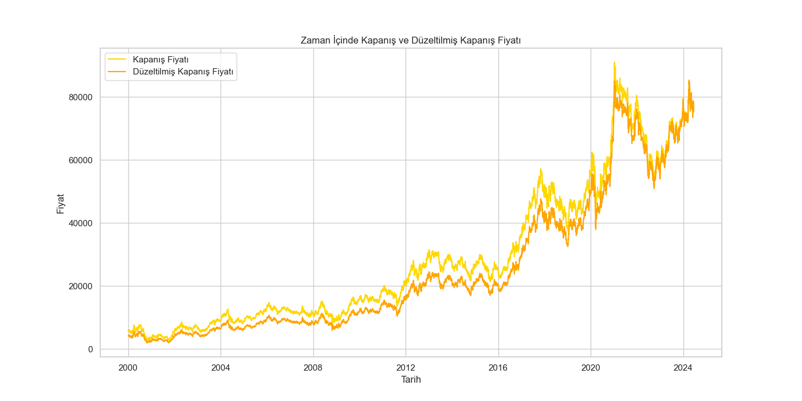
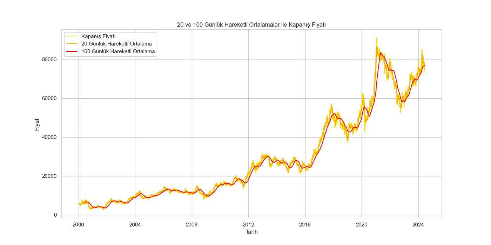
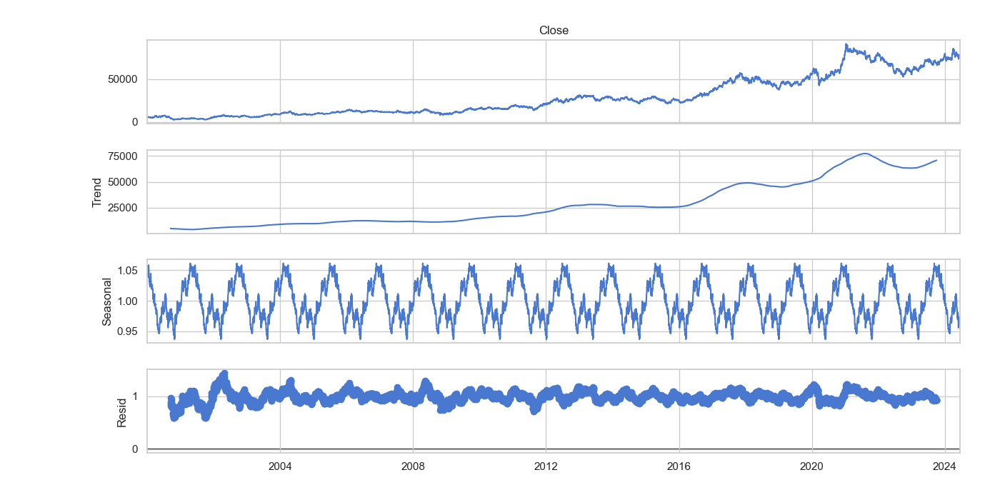
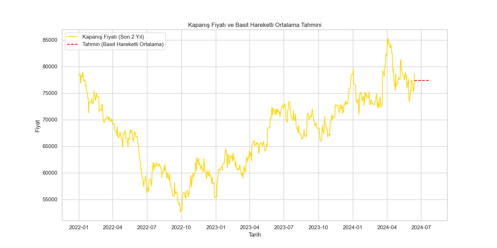
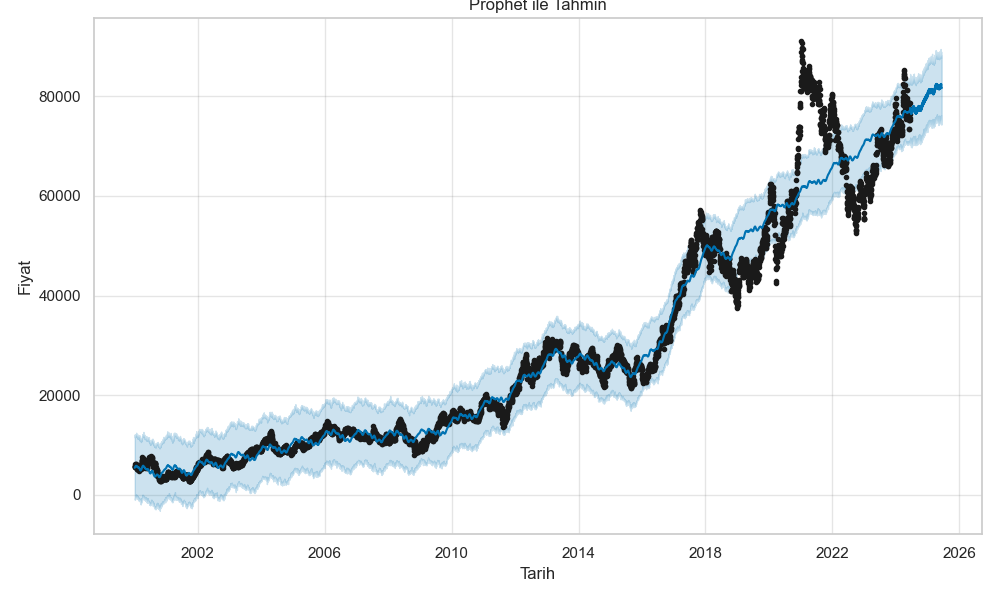
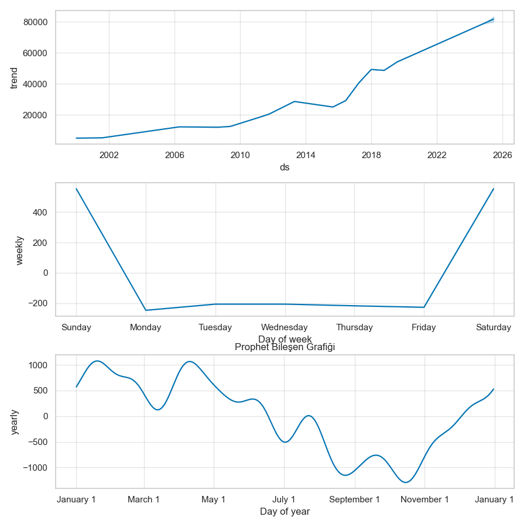
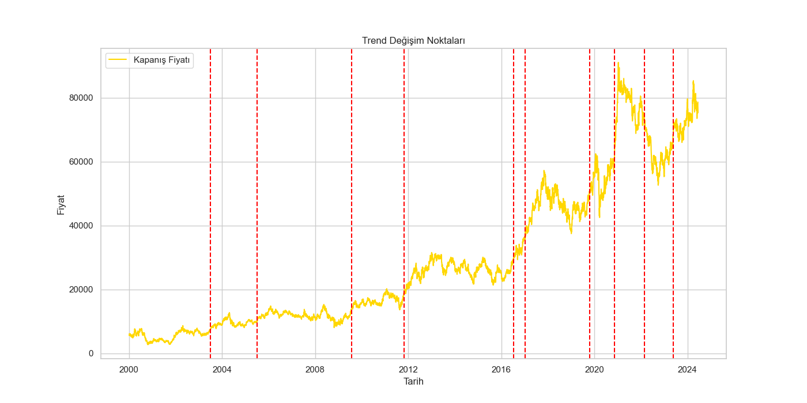
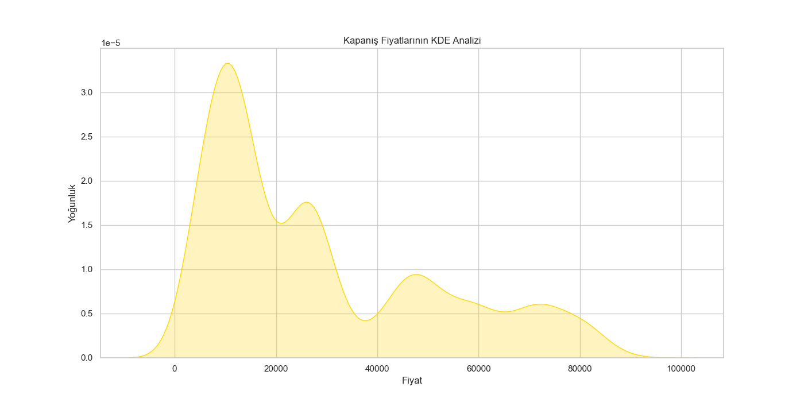
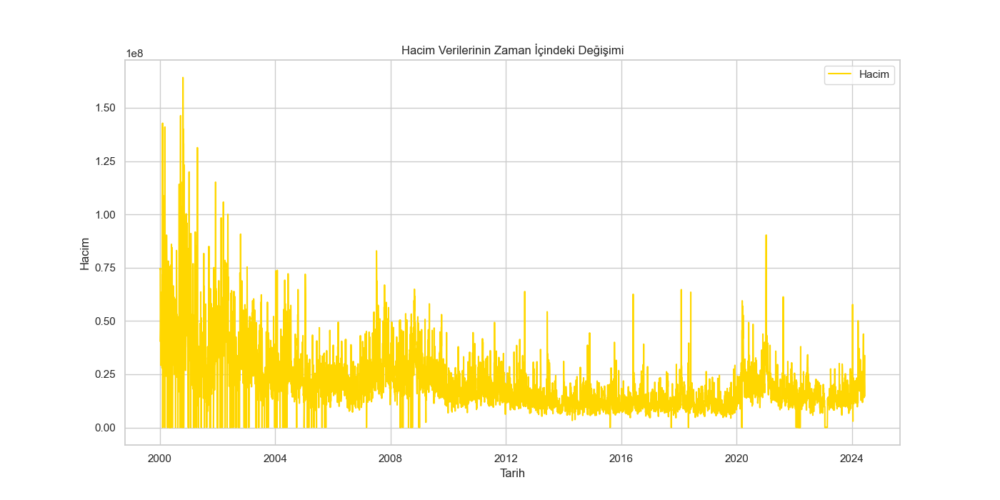
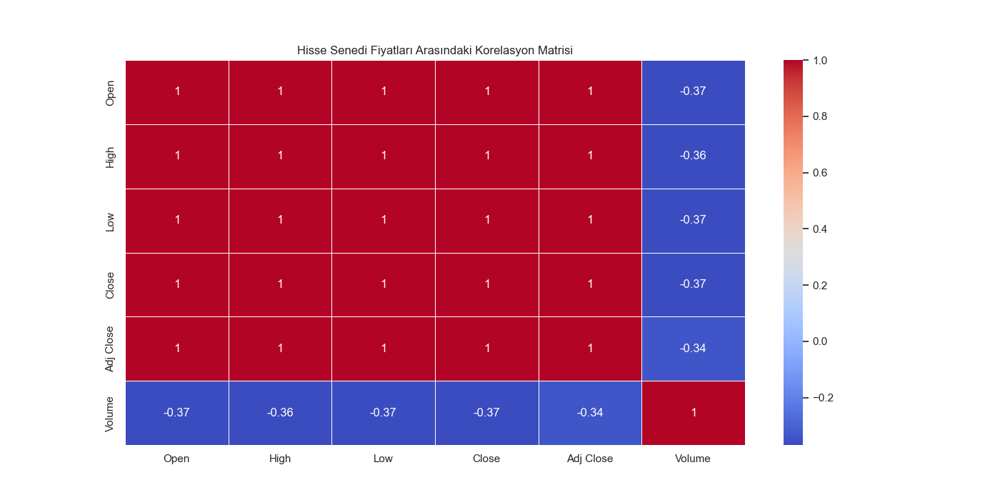

# 📈 Samsung Hisse Analizi

## Genel Bakış
Bu proje, Samsung'un hisse verilerinin kapsamlı bir analizini içermektedir. Analiz, zaman serisi ayrıştırması, korelasyon analizi, hareketli ortalamalar, SARIMA ve Prophet tahmini, trend değişim tespiti ve volatilite analizini kapsamaktadır. Sonuçlar görselleştirilmiş ve `results` dizininde saklanmıştır.

## Veri Ön İşleme
- **📅 Eksik Değerler**: Veri kümesi eksik değerler açısından kontrol edilmiş ve varsa ileri doldurma yöntemiyle doldurulmuştur.
- **🕒 Tarih Dönüştürme**: Tarih sütunu datetime formatına dönüştürülmüş ve indeks olarak ayarlanmıştır.

## Keşifsel Veri Analizi
1. **🔍 Betimsel İstatistikler**: Verilerin temel istatistikleri hesaplanmıştır.
2. **📊 Korelasyon Matrisi**: Farklı hisse metrikleri arasındaki korelasyon hesaplanmış ve görselleştirilmiştir.
3. **🚨 Aykırı Değer Tespiti**: Z-skorları kullanılarak aykırı değerler tespit edilmiştir.

## Zaman Serisi Analizi
1. **📈 Kapanış ve Düzeltilmiş Kapanış Fiyatları**: Kapanış ve düzeltilmiş kapanış fiyatlarının zaman serisi çizilmiştir.
   
2. **📉 Hareketli Ortalamalar**: 20 günlük ve 100 günlük hareketli ortalamalar hesaplanmış ve çizilmiştir.
   
3. **🌀 Mevsimsel Ayrıştırma**: Veriler trend, mevsimsel ve artık bileşenlere ayrıştırılmıştır.
   
4. **📅 Getiriler**: Günlük ve aylık getiriler hesaplanmış ve görselleştirilmiştir.
   
   
5. **📉 Volatilite**: 30 günlük hareketli volatilite hesaplanmış ve çizilmiştir.
   

## Tahmin
1. **📊 SARIMA Modeli**: Son 2 yılın verileri üzerine bir SARIMA modeli kurulmuş ve önümüzdeki 30 gün tahmin edilmiştir.
   

   - SARIMA modeli, zaman serisi verilerindeki mevsimsellik ve trendi dikkate alarak gelecekteki fiyatları tahmin eder.
   - Tahminler, gelecekteki fiyat hareketleri hakkında bilgi sağlar ve yatırım kararlarını destekler.

2. **📈 Prophet Modeli**: Prophet modeli veriler üzerine kurulmuş ve bir yıl ileriye yönelik tahminler yapılmıştır. Tahminler ve bileşen grafikleri çizilmiştir.
   
   

   - Prophet modeli, zaman serisi verilerinde trend ve mevsimselliği dikkate alarak tahmin yapar.
   - Bileşen grafikleri, tahminlerin hangi faktörlerden etkilendiğini gösterir.

## İleri Düzey Analiz
1. **📈 Trend Değişimi Tespiti**: `ruptures` kütüphanesi kullanılarak trend değişim noktaları tespit edilmiş ve görselleştirilmiştir.
   

   - Trend değişim noktaları, hisse fiyatlarında önemli değişikliklerin olduğu dönemleri gösterir.
   - Bu noktalar, yatırımcılar için önemli alım veya satım fırsatlarını işaret edebilir.

2. **📊 KDE Analizi**: Kapanış fiyatlarının yoğunluk dağılımı Kernel Yoğunluk Tahmini kullanılarak analiz edilmiştir.
   

   - KDE analizi, hisse fiyatlarının dağılımını gösterir.
   - Fiyatların yoğunlaştığı bölgeler, destek ve direnç seviyeleri hakkında bilgi verebilir.

3. **📉 Hacim Analizi**: İşlem hacminin zaman içindeki değişimi analiz edilmiş ve çizilmiştir.
   

   - Hacim analizi, piyasa katılımcılarının hisse senedine olan ilgisini gösterir.
   - Yüksek hacim, likiditenin arttığını ve fiyat hareketlerinin daha güvenilir olduğunu gösterir.


## Sonuçlar ve Öneriler
- **🔍 Betimsel İstatistikler**: Özet istatistikler, hisse verilerinin merkezi eğilim ve dağılımı hakkında bilgi sağlar.
- **📊 Korelasyon Matrisi**: Korelasyonların görsel temsili, farklı hisse metrikleri arasındaki ilişkileri anlamaya yardımcı olur.
  
- **📈 Hareketli Ortalamalar**: Hareketli ortalamaların kapanış fiyatları ile birlikte çizilmesi, trendlerin belirlenmesinde ve kısa vadeli dalgalanmaların düzleştirilmesinde yardımcı olur.
- **🌀 Mevsimsel Ayrıştırma**: Zaman serisi verilerinin trend, mevsimsel ve artık bileşenlere ayrıştırılması, altında yatan modelleri anlamaya yardımcı olur.
- **📅 Getiriler ve Volatilite**: Getiriler ve volatilitenin analizi, hissenin risk ve getiri profili hakkında bilgi sağlar.
- **📊 Tahmin**: Hem SARIMA hem de Prophet modelleri, gelecekteki fiyat tahminleri sağlar ve öngörücü analizlerde yardımcı olur.
- **📈 Trend Değişimi Tespiti**: Trend değişimlerinin tespiti, hisse fiyatı hareketlerindeki önemli değişimleri anlamaya yardımcı olur.
- **📊 KDE ve Hacim Analizi**: Ek analizler, fiyat dağılımları ve işlem hacimleri hakkında daha derinlemesine bilgi sağlar.

### Öneriler

1. **📈 Yatırım Stratejileri**
   - **Kısa Vadeli Yatırım**: Hareketli ortalamalar ve kısa vadeli tahminler (SARIMA ve Basit Hareketli Ortalama) kısa vadeli yatırım stratejilerini destekleyebilir. Özellikle 20 günlük ve 100 günlük hareketli ortalamalar, kısa vadeli alım-satım kararları için kullanılabilir.
   - **Uzun Vadeli Yatırım**: Prophet modelinden elde edilen uzun vadeli tahminler, uzun vadeli yatırımcılar için değerli olabilir. Gelecek bir yıl içinde hisse fiyatlarının genel trendini gözlemleyerek uzun vadeli alım kararları alınabilir.

2. **🚨 Risk Yönetimi**
   - **Volatilite Analizi**: 30 günlük hareketli volatilite analizine dayanarak, yatırımcılar hisse senedinin risk profilini değerlendirebilir ve buna göre risk yönetimi stratejileri geliştirebilir. Yüksek volatilite dönemlerinde daha dikkatli olunmalı ve stop-loss emirleri kullanılmalıdır.
   - **Trend Değişimi**: Trend değişim noktalarının tespiti, hisse fiyatlarında ani değişiklikler olabileceğini gösterir. Bu dönemlerde piyasaları yakından takip etmek ve gerektiğinde pozisyonları gözden geçirmek önemlidir.

3. **🌀 Sezonluk ve Mevsimsel Fırsatlar**
   - **Mevsimsel Ayrıştırma**: Mevsimsel bileşenler, belirli dönemlerde hisse fiyatlarının mevsimsel olarak nasıl değiştiğini gösterir. Bu bilgi, sezonluk yatırım fırsatlarını değerlendirmek için kullanılabilir.
   - **Yıllık ve Aylık Ortalamalar**: Aylık ve yıllık ortalama fiyat analizleri, belirli dönemlerdeki fiyat trendlerini gösterir. Özellikle belirli aylarda düzenli olarak fiyat artışları veya düşüşleri varsa, bu dönemler yatırım kararlarında dikkate alınabilir.

4. **📊 Hacim Analizi**
   - **Hacim Verilerinin Değerlendirilmesi**: İşlem hacmindeki değişiklikler, piyasa katılımcılarının hisse senedine olan ilgisini yansıtır. Yüksek hacim dönemlerinde likiditenin artması, büyük alım-satım işlemleri için uygun olabilir.
   - **Hacim ve Fiyat İlişkisi**: Hacim verileri ile fiyat hareketleri arasındaki ilişkiyi analiz ederek, hacim bazlı stratejiler geliştirilebilir. Örneğin, hacimde ani artışlar fiyat değişikliklerinin habercisi olabilir.

5. **📈 Teknik Analiz ve Göstergeler**
   - **Teknik Göstergeler**: Kapanış fiyatlarının KDE analizi, fiyatların yoğunluk dağılımını gösterir. Bu bilgi, destek ve direnç seviyelerinin belirlenmesinde kullanılabilir.
   - **Korelasyon Analizi**: Farklı hisse senedi metrikleri arasındaki korelasyonlar, çeşitli teknik göstergelerin birlikte nasıl çalıştığını anlamaya yardımcı olabilir. Bu, daha karmaşık ticaret stratejileri geliştirmek için kullanılabilir.

6. **📅 Gelecek Beklentiler ve Stratejik Planlama**
   - **Prophet Tahminleri**: Prophet modelinden elde edilen bir yıllık fiyat tahminleri, gelecekteki fiyat hareketlerini öngörmek için kullanılabilir. Bu tahminler, uzun vadeli yatırım ve stratejik planlama için değerli bilgiler sağlar.
   - **Trend Analizi**: Uzun vadeli trendlerin belirlenmesi, şirketin genel performansı ve piyasa koşulları hakkında fikir verir. Bu bilgiler, stratejik yatırım kararları almak için kullanılabilir.

## Görseller
Tüm görseller `results` dizininde saklanmıştır ve daha detaylı incelemeler için kullanılabilir.

## Analizi Çalıştırma
Analizi çalıştırmak için `scripts/data_analysis.py` dosyasını çalıştırın:

```bash
python scripts/data_analysis.py
```