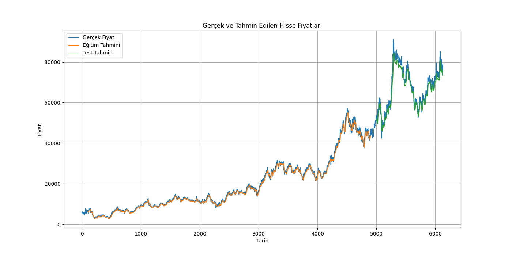
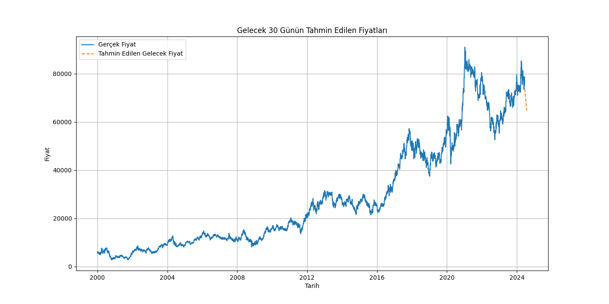
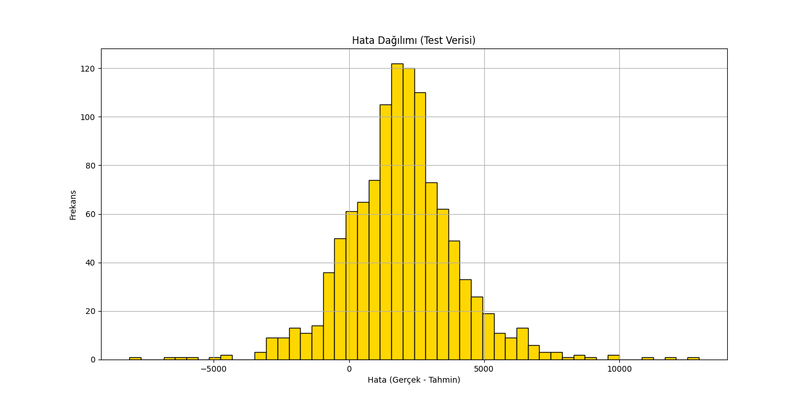

# 📊 Samsung Hisse Senedi Fiyat Tahmini

## Genel Bakış 🌟
Bu proje, Samsung hisse senedi fiyatlarının geçmiş verilerini kullanarak LSTM (Long Short-Term Memory) modeli ile gelecekteki fiyatlarını tahmin etmeyi amaçlamaktadır. Proje, veri ön işleme, model oluşturma, model eğitimi ve geleceğe yönelik tahminler adımlarını içermektedir.

## Neler Yaptık 🔍
1. **Veri Ön İşleme**:
   - Veri seti yüklendi ve tarih sütunu datetime formatına dönüştürüldü.
   - Kapanış fiyatları seçildi ve veriler ölçeklendirildi.
   - Eğitim ve test verileri ayrıldı ve LSTM modeli için uygun hale getirildi.
2. **Model Oluşturma ve Eğitim**:
   - İki katmanlı LSTM modeli oluşturuldu.
   - Model, eğitim verileri üzerinde 5 epoch boyunca eğitildi.
   - Modelin performansı RMSE, MAE, MAPE ve R² metrikleri kullanılarak değerlendirildi.
3. **Tahmin Değerlendirme**:
   - Modelin eğitim ve test verileri üzerindeki performansı değerlendirildi.
   - Gelecek 30 gün için fiyat tahminleri yapıldı.

## Tahmin Değerlendirme 📈
- **Train RMSE**: 851.91
- **Test RMSE**: 2840.27
- **Train MAE**: 613.94
- **Test MAE**: 2294.21
- **Train MAPE**: 3.77
- **Test MAPE**: 3.35
- **Train R²**: 0.9956
- **Test R²**: 0.9202
- **Train Accuracy**: 45.99%
- **Test Accuracy**: 46.62%

## Sonuçlar ve Öneriler 📝
- **Model Performansı**: Model, eğitim verileri üzerinde oldukça iyi bir performans gösterdi, ancak test verilerindeki performansı daha düşük. Bu, modelin aşırı öğrenme (overfitting) yapmış olabileceğini gösterir.
- **Gelecek 30 Gün Tahminleri**: Modelin tahminleri, mevcut trendlere dayalı olarak makul seviyelerde. Ancak, bu tahminlerin doğruluğunu artırmak için daha fazla veri ve özellik kullanılabilir.
- **Geliştirme Önerileri**:
  - **Daha Fazla Veri**: Modelin doğruluğunu artırmak için daha fazla geçmiş veri kullanılabilir.
  - **Hiperparametre Optimizasyonu**: Modelin hiperparametrelerini optimize ederek daha iyi performans elde edilebilir.
  - **Ek Özellikler**: Ekonomik göstergeler, sektörel haberler ve piyasa duyarlılığı gibi ek özellikler modelin performansını artırabilir.
  - **Gelişmiş Modeller**: GRU veya Transformer gibi daha gelişmiş modeller kullanılarak performans iyileştirilebilir.

## Görseller 📊

### Gerçek ve Tahmin Edilen Hisse Fiyatları

Bu grafik, gerçek hisse senedi fiyatları ile modelin eğitim ve test verileri üzerindeki tahminlerini karşılaştırmaktadır.

### Gelecek 30 Gün Tahminleri

Bu grafik, modelin gelecek 30 gün için tahmin ettiği hisse senedi fiyatlarını göstermektedir.

### Eğitim ve Test Hataları

Bu grafik, modelin eğitim ve test verileri üzerindeki hatalarını göstermektedir. Hataların dağılımı, modelin performansını değerlendirmek için önemlidir.

### Hata Dağılımı

Bu grafik, modelin tahmin hatalarının dağılımını göstermektedir. Hata dağılımı, modelin doğruluğunu ve güvenilirliğini değerlendirmek için kullanılır.

---

Bu çalışma, Samsung hisse senedi fiyatlarının tahmini konusunda derin öğrenme tekniklerinin potansiyelini göstermektedir. Modelin performansını daha da artırmak için yukarıda belirtilen geliştirme önerileri dikkate alınmalıdır.

## Görseller
Tüm görseller `results` dizininde saklanmıştır ve daha detaylı incelemeler için kullanılabilir.

## Analizi Çalıştırma
Analizi çalıştırmak için `scripts/samsung_stock_volume_forecast.py` dosyasını çalıştırın:

```bash
python scripts/data_analysis.py
```