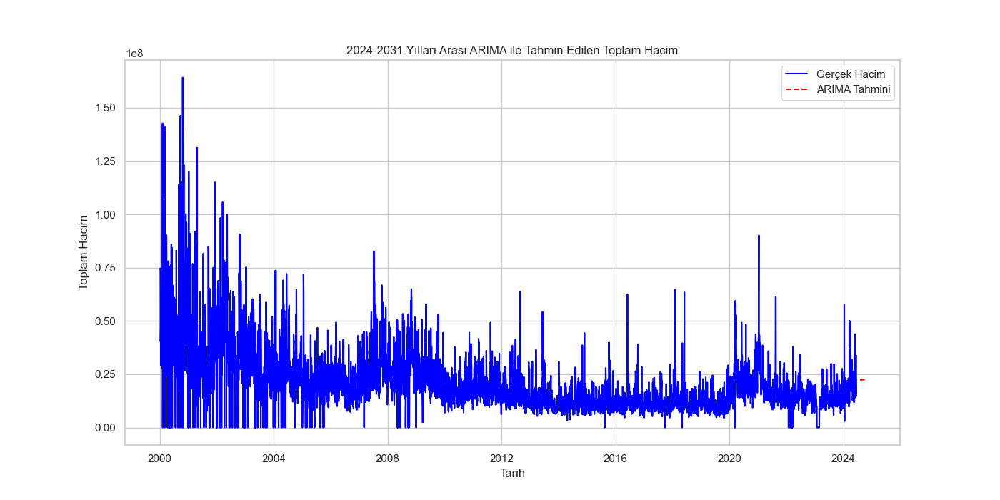

### 📊 Samsung Hisse Senedi Hacim Tahmini

---

## Genel Bakış 🌟

Bu proje, Samsung hisse senedi hacim verilerini kullanarak gelecekteki hacim tahminlerini yapmayı amaçlamaktadır. Çalışmada veri yükleme ve hazırlık, tarihsel eğilimlerin belirlenmesi, çeşitli modellerle hacim tahminleri ve mevsimsellik ve trend analizleri yapılmıştır. Bu analizler, yatırımcılar ve piyasa analistleri için değerli içgörüler sunmayı hedeflemektedir.

---

## Neler Yaptık 🔍

1. **Veri Yükleme ve Hazırlık**:
    - Veri seti yüklendi ve tarih sütunu datetime formatına dönüştürüldü.
    - Hacim verileri iş günlerine göre frekans ayarlandı ve eksik değerler ileri doldurma yöntemiyle tamamlandı.

2. **Tarihsel Eğilimlerin Belirlenmesi**:
    - 30 günlük hareketli ortalama hesaplandı ve görselleştirildi.

3. **Hacim Tahminleri**:
    - **Lineer Regresyon Modeli** kullanılarak 2024-2031 yılları için hacim tahminleri yapıldı.
    - **ARIMA Modeli** kullanılarak 2024-2031 yılları için hacim tahminleri yapıldı.

4. **Mevsimsellik ve Trend Analizi**:
    - Additif model kullanarak mevsimsel decompose işlemi yapıldı.

5. **Günlük ve Aylık Getiri Hesaplamaları**:
    - Günlük ve aylık getiri hesaplamaları yapıldı ve görselleştirildi.

6. **Volatilite Analizi**:
    - 30 günlük volatilite hesaplandı ve görselleştirildi.

---

## Adımlar 🔨

1. **Veri Yükleme ve Hazırlık**
    - `pandas` ve `numpy` kullanarak veri yüklendi ve ön işlemden geçirildi.
    - Eksik veriler ileri doldurma yöntemiyle tamamlandı.
    
2. **Hareketli Ortalama Analizi**
    - Hisse senedi hacmi ve 30 günlük hareketli ortalama hesaplandı.
    - Grafiklerle görselleştirildi.
    
3. **Hacim Tahmin Modelleri**
    - Lineer regresyon modeli oluşturuldu ve tahminler yapıldı.
    - ARIMA modeli kullanılarak daha gelişmiş tahminler yapıldı.
    
4. **Mevsimsellik ve Trend Analizi**
    - Mevsimsel ve trend bileşenleri ayrıştırıldı ve analiz edildi.
    
5. **Getiri ve Volatilite Analizi**
    - Günlük ve aylık getiri hesaplamaları yapıldı.
    - 30 günlük volatilite analizi yapıldı.

---

## Tahmin Değerlendirme 📈

### Lineer Regresyon Modeli ile Hacim Tahmini

| Yıl  | Tahmin Edilen Hacim   |
|------|-----------------------|
| 2024 | 1.924352e+09          |
| 2025 | 1.638576e+09          |
| 2026 | 1.352801e+09          |
| 2027 | 1.067026e+09          |
| 2028 | 7.812506e+08          |
| 2029 | 4.954753e+08          |
| 2030 | 2.097000e+08          |
| 2031 | -7.607531e+07         |

### ARIMA Modeli ile Hacim Tahmini

| Yıl  | Tahmin Edilen Hacim   |
|------|-----------------------|
| 2024 | 1.879584e+09          |
| 2025 | 1.643756e+09          |
| 2026 | 1.397928e+09          |
| 2027 | 1.152100e+09          |
| 2028 | 9.062724e+08          |
| 2029 | 6.604445e+08          |
| 2030 | 4.146166e+08          |
| 2031 | 1.687887e+08          |

---

## Sonuçlar 📝

### Model Performansı

- **Lineer Regresyon Modeli**: Doğrusal modeller karmaşık piyasa dinamiklerini yeterince yakalayamayabilir.
- **ARIMA Modeli**: Mevsimsellik ve trend bileşenlerini dikkate alarak daha doğru tahminler yapabilir.

### Geliştirme Önerileri

- **Ek Özellikler**: Ekonomik göstergeler ve piyasa duyarlılığı gibi ek özellikler modelin performansını artırabilir.
- **Daha Fazla Veri**: Daha fazla veri kullanılarak modelin doğruluğu artırılabilir.
- **Gelişmiş Modeller**: GRU veya Transformer gibi daha gelişmiş modeller kullanılarak performans iyileştirilebilir.

---

## Görseller 📊

### Hacim ve 30 Günlük Hareketli Ortalama


Bu grafik, hisse senedi hacmi ve 30 günlük hareketli ortalamayı göstermektedir.

---

### Lineer Regresyon Modeli ile Tahmin Edilen Hacim (2024-2031)


Bu grafik, 2024-2031 yılları arasındaki tahmin edilen toplam hacmi göstermektedir.

---

### ARIMA Modeli ile Tahmin Edilen Hacim (2024-2031)


Bu grafik, ARIMA modeli kullanılarak tahmin edilen 2024-2031 yılları arasındaki toplam hacmi göstermektedir.

---

### Mevsimsellik ve Trend Analizi


Bu grafik, hisse senedi hacmindeki mevsimsellik ve trendleri göstermektedir.

---

### Günlük Getiriler


Bu grafik, hisse senedi hacmindeki günlük getirileri göstermektedir.

---

### Aylık Getiriler


Bu grafik, hisse senedi hacmindeki aylık getirileri göstermektedir.

---

### 30 Günlük Volatilite


Bu grafik, hisse senedi hacmindeki 30 günlük volatiliteyi göstermektedir.

---

## Analizi Çalıştırma
Analizi çalıştırmak için `scripts/samsung_stock_volume_forecast.py` dosyasını çalıştırın:

```bash
python scripts/data_analysis.py
```

Bu çalışma, Samsung hisse senedi hacim tahmininde zaman serisi analizlerinin ve çeşitli modellerin kullanımının potansiyelini göstermektedir. Model performansını daha da artırmak için yukarıda belirtilen geliştirme önerileri dikkate alınmalıdır.

